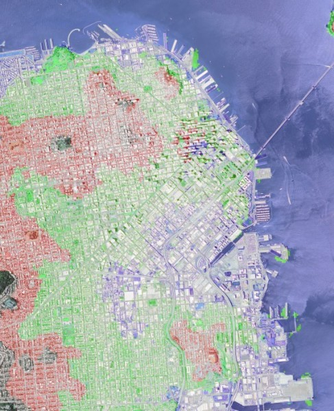

.. _Raster_IO_GDAL:
    

Reading Geospatial Raster files with GDAL
*****************************************

Geospatial raster data is a heavily used product in Geographic Information
Systems and Photogrammetry.  Raster data typically can represent imagery 
and Digital Elevation Models (DEM).  The standard library for loading
GIS imagery is the Geographic Data Abstraction Library (GDAL).  In this example, we
will show techniques for loading GIS raster formats using native OpenCV functions.
In addition, we will show some an example of how OpenCV can use this data for 
novel and interesting purposes.

Goals
=====

The primary objectives for this tutorial:

.. container:: enumeratevisibleitemswithsquare
    
    + How to use OpenCV imread to load satellite imagery.
    + How to use OpenCV imread to load SRTM Digital Elevation Models
    + Given the corner coordinates of both the image and DEM, correllate the elevation data to the image to find elevations for each pixel.
    + Show a basic, easy-to-implement example of a terrain heat map.
    + Show a basic use of DEM data coupled with ortho-rectified imagery.

To implement these goals, the following code takes a Digital Elevation Model as well as a GeoTiff image of San Francisco as input.
The image and DEM data is processed and generates a terrain heat map of the image as well as labels areas of the city which would 
be affected should the water level of the bay rise 10, 50, and 100 meters.  

Code
====

.. literalinclude:: ../../../../samples/cpp/tutorial_code/HighGUI/GDAL_IO/gdal-image.cpp
   :language: cpp
   :linenos:
   :tab-width: 4

How to Read Raster Data using GDAL
======================================

This demonstration uses the default OpenCV :ocv:func:`imread` function.  The primary difference is that in order to force GDAL to load the 
image, you must use the appropriate flag.

.. code-block:: cpp

    cv::Mat image = cv::imread( argv[1], cv::IMREAD_LOAD_GDAL );

When loading digital elevation models, the actual numeric value of each pixel is essential
and cannot be scaled or truncated.  For example, with image data a pixel represented as a double with a value of 1 has
an equal appearance to a pixel which is represented as an unsigned character with a value of 255. 
With terrain data, the pixel value represents the elevation in meters.  In order to ensure that OpenCV preserves the native value,
use the GDAL flag in imread with the ANYDEPTH flag.

.. code-block:: cpp

    cv::Mat dem = cv::imread( argv[2], cv::IMREAD_LOAD_GDAL | cv::IMREAD_ANYDEPTH );

If you know beforehand the type of DEM model you are loading, then it may be a safe bet to test the ``Mat::type()`` or ``Mat::depth()`` 
using an assert or other mechanism. NASA or DOD specification documents can provide the input types for various 
elevation models.  The major types, SRTM and DTED,  are both signed shorts. 

Results
=======

Below is the output of the program. 

.. image:: images/output.jpg 

.. image:: images/heat-map.jpg

